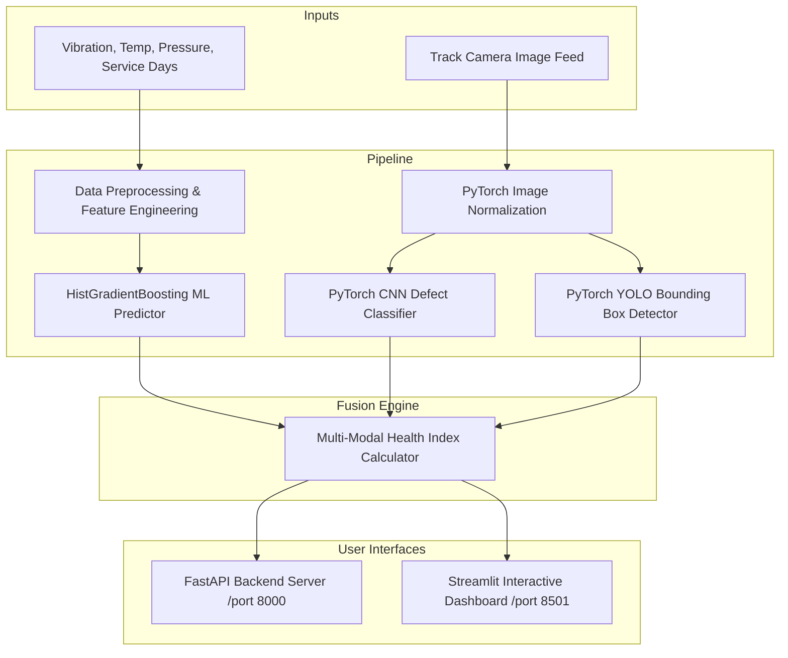

# 🚆 Railway Track Failure & Object Detection System (10-Phase End-to-End Pipeline)

[](https://www.python.org/)
[](https://fastapi.tiangolo.com/)
[](https://streamlit.io/)
[](https://pytorch.org/)
[](https://scikit-learn.org/)

An enterprise-grade, multi-modal AI Railway Track Inspection & Safety Platform combining **Telemetry Sensor Machine Learning (Failure Risk)** and **Computer Vision Deep Learning (CNN Defect Classification & YOLO Object Detection)**.

---

## 📌 10-Phase Sequential Roadmap Summary

| Phase | Title | Key Output & Architecture | GitHub Commit Status |
| :--- | :--- | :--- | :--- |
| **Phase 1** | **Data Collection** | Track telemetry sensors CSV (`vibration_g`, `temperature_c`, `pressure_psi`, `maintenance_days`) & synthetic railway image dataset | `Uploaded` |
| **Phase 2** | **Data Preprocessing** | Deduplication, median missing value imputation, IQR outlier clipping, categorical encoding | `Uploaded` |
| **Phase 3** | **EDA & Data Analysis** | Class imbalance analysis, Seaborn boxplots, feature correlation heatmaps, summary JSON report | `Uploaded` |
| **Phase 4** | **Feature Engineering** | Rolling vibration statistics (mean, std, peak-to-peak), temperature anomaly score, stress-vibration ratio | `Uploaded` |
| **Phase 5** | **ML Failure Prediction** | Trained HistGradientBoosting Classifier (86.0% Accuracy, 91.38% F1 Score, 88.29% ROC-AUC), saved `.pkl` model | `Uploaded` |
| **Phase 6** | **Image Preprocessing & Aug** | PyTorch tensor normalization (640x640), Albumentations horizontal flips, rotation, brightness jitter | `Uploaded` |
| **Phase 7** | **DL Defect Detection** | PyTorch CNN Track Defect Classifier (`cnn_classifier.pt`) + PyTorch YOLO Object Detector (`yolo_detector.pt`) | `Uploaded` |
| **Phase 8** | **Model Evaluation** | Evaluation suite calculating Accuracy, Precision, Recall, F1, ROC-AUC, mAP50, IoU & Confusion Matrix plot | `Uploaded` |
| **Phase 9** | **ML + DL Integration** | Unified multi-modal inference pipeline calculating Railway Track Health Index (0-100%) | `Uploaded` |
| **Phase 10** | **Deployment & Dashboard** | FastAPI REST API backend (`app/api.py`) + Streamlit Interactive Web Dashboard (`app/dashboard.py`) + PyTest Suite | `Uploaded` |

---

## 🏗️ System Architecture



---

## 💻 Quick Start & Installation

### 1. Clone & Install Dependencies
```bash
git clone https://github.com/ftarunnnn/Railway-Track-Failure-Object-Detection.git
cd Railway-Track-Failure-Object-Detection
pip install -r requirements.txt
```

### 2. Run Data Pipeline & Train Models
```bash
# Phase 1: Collect Data
python -m src.data.collector

# Phase 2: Preprocess Data
python -m src.data.preprocessing

# Phase 3: Run EDA
python -m src.eda.exploratory_analysis

# Phase 4: Feature Engineering
python -m src.features.engineering

# Phase 5: Train ML Model
python -m src.models.ml_failure_predictor

# Phase 6 & 7: Train DL Vision Models
python -m src.vision.cnn_classifier
python -m src.vision.yolo_detector

# Phase 8: Model Evaluation
python -m src.evaluation.evaluator
```

---

## 🚀 Running FastAPI Backend & Streamlit Dashboard

### Launch FastAPI Server
```bash
python -m uvicorn app.api:app --host 0.0.0.0 --port 8000 --reload
```
- Interactive API Docs: `http://localhost:8000/docs`

### Launch Streamlit Dashboard
```bash
python -m streamlit run app/dashboard.py
```
- Interactive Web Dashboard: `http://localhost:8501`

---

## 🧪 Running Automated Tests

```bash
python -m pytest tests/
```

---

## 📊 Dashboard Display Features

- 🔴 **Failure Risk Level & Probability Gauge**: Live ML sensor failure percentage indicator.
- 🛤️ **Track Defect Type Classifier Display**: CNN classification (`normal`, `broken_rail`, `crack`, `missing_fishplate`, `obstacle`).
- 🚧 **Obstacle Detection Canvas**: YOLO localized bounding box overlay with confidence badges.
- 📊 **Model Confidence & Metrics Breakdown**: System health score from 0 (Critical Hazard) to 100 (Safe Operation).
- 📈 **Real-time / Historical Sensor Trend Graphs**: Interactive Matplotlib/Seaborn telemetry graphs.

---

## 📜 License
Developed for Railway Inspection & Object Detection Research.